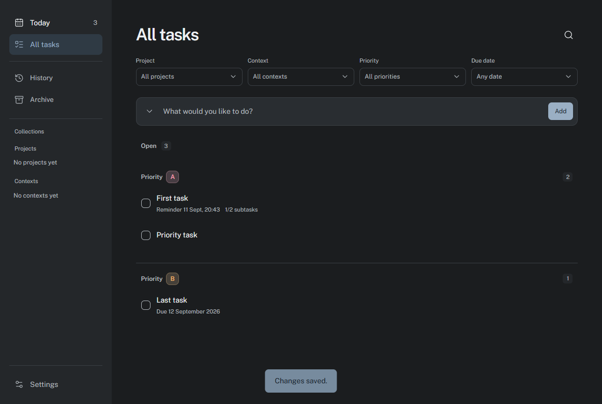
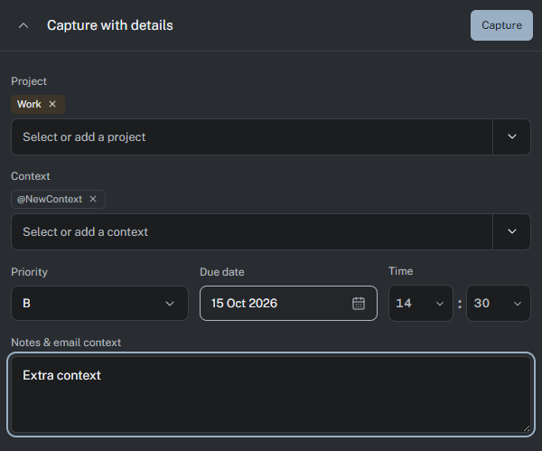
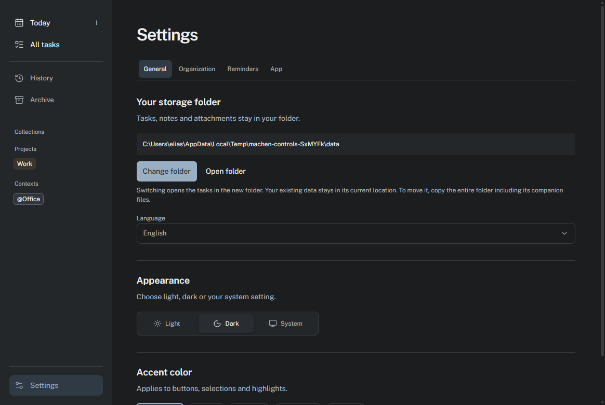

# Machen

**A calm, local task app built around [`todo.txt`](https://github.com/todotxt/todo.txt).**

Machen keeps tasks in files you own. There is no account, cloud service, or lock-in. Capture a task, plan your day, and open the details only when you need them.

[Website and FAQ](https://sirkyomi.github.io/machen/)

## Download

[Download for Windows](https://github.com/sirkyomi/machen/releases/latest/download/machen-win-x64-Setup.exe)

[Download for macOS](https://github.com/sirkyomi/machen/releases/latest/download/machen-osx-arm64-Setup.pkg)

[Download for Linux](https://github.com/sirkyomi/machen/releases/latest/download/machen-linux-x64.AppImage)

The current macOS package is for Apple Silicon. Windows, macOS, and Linux packages are unsigned, so your operating system may ask for confirmation during installation.

## Your day in one place



Machen puts today's work first. The weekly date strip helps you plan ahead, while projects, contexts, due dates, and priority groups keep the list easy to scan. Tasks with a priority are grouped from A to Z, then ordered by due date.

Use the command palette to move quickly through views and actions. Quick Capture opens from anywhere with `Ctrl+Shift+Space` on Windows and Linux, or `Cmd+Shift+Space` on macOS. The shortcut can be changed in Settings.

## Details without clutter



Open a task to add notes, a due date and time, priority, projects, contexts, attachments, and a small checklist of subtasks. The dialog stays focused on one task and closes after saving.

Due-date reminders can notify you at a selected time. You can postpone a reminder for ten minutes, one hour, or until tomorrow. The History and Archive views keep completed work available without crowding today's list.

## Fits your setup



Machen supports English and German, light, dark, and system themes. It can stay available in the system tray after the main window closes, launch at sign-in on Windows and macOS, and show a freely movable pinned-task panel above other windows.

Choose a storage folder on first launch. It can be a normal local folder or a folder managed by your preferred sync service. Changing the folder in Settings opens that folder and never moves existing files.

## Your files stay yours

Machen reads and writes the familiar [`todo.txt`](https://github.com/todotxt/todo.txt) format:

```text
(A) Send proposal +Work @email due:2026-09-11 id:UUID
x 2026-09-10 2026-09-09 Send proposal +Work @email due:2026-09-11 pri:A id:UUID
```

| File | Purpose |
| --- | --- |
| `todo.txt` | Active tasks and completed tasks that have not been archived |
| `done.txt` | Archived completed tasks |
| `metadata/.machen.json` | Notes, due times, reminders, subtasks, and attachment references |
| `metadata/events.json` | Activity history |
| `metadata/attachments/` | Copies of files attached to tasks |
| `backups/todo.txt.bak`, `backups/done.txt.bak` | The state before the latest write |

Projects use `+Project`; contexts use `@context`. Machen stores due dates as `due:YYYY-MM-DD`, priority as `pri:A`, and planned days as `t:YYYY-MM-DD`. These additions retain todo.txt compatibility. Keep the `id:` field when editing files in another app so notes, attachments, and history remain connected to the right task.

Machen reloads external edits when it regains focus and every 30 seconds. Avoid writing to the same files from multiple apps at the exact same time because sync services can create conflict copies.

## Updates

Installed copies check for updates at launch and then every four hours. Downloads and installation always require your click. You can also check manually from Settings.

## For contributors

Machen is an Electron app. To run it from source, install Node.js 24 or later and run:

```sh
npm ci
npm start
```

Useful checks:

```sh
npm run check
npm test
npm run test:ui
```

Package and release tooling lives in `scripts/`. GitHub Actions builds the public desktop packages after a push to `main`; it calculates the next patch version from release tags. See the [Actions page](https://github.com/sirkyomi/machen/actions) for build status.

## License

[MIT](LICENSE). Third-party asset notices are in [THIRD_PARTY_NOTICES.md](THIRD_PARTY_NOTICES.md).
